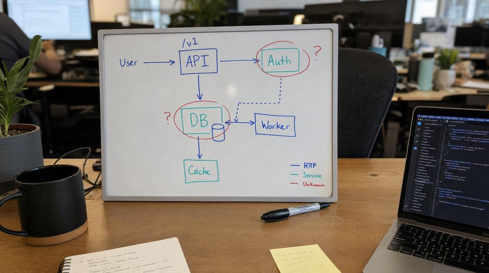

# mcp-oauth-starter



A minimal, **runnable** reference for a **remote MCP server protected by OAuth 2.1** — the flow that lets a client like Claude Desktop add your server as a custom connector by URL and sign in, with no install and no API key to copy around.

Framework-agnostic TypeScript (`node:http` + [`jose`](https://github.com/panva/jose)), an in-memory store, and a demo consent screen, so the whole thing runs in one command. It's the distilled, generic version of what we shipped at [SkillDB](https://skilldb.dev) — see the writeup: **[Shipping an OAuth-protected remote MCP server](https://skilldb.dev/blog/oauth-remote-mcp-server)**.

## Run it

```bash
npm install
npx tsx src/server.ts
# MCP OAuth starter on http://localhost:8080
```

Point any MCP client that supports remote servers at `http://localhost:8080/mcp`, or drive the flow by hand (below).

## The flow this implements

```
client ──POST /mcp (no token)──────────────► 401 + WWW-Authenticate: resource_metadata="…"
       ──GET  /.well-known/oauth-protected-resource ► { resource, authorization_servers }
       ──GET  /.well-known/oauth-authorization-server ► { authorize, token, register, S256, … }
       ──POST /register (DCR) ──────────────► { client_id }                       (RFC 7591)
       ──browser GET /authorize ────────────► consent screen
       ──POST /authorize/consent (approve) ─► 302 redirect_uri?code=…&state=…
       ──POST /token (code + PKCE verifier)─► { access_token (JWT), refresh_token }
       ──POST /mcp (Bearer <JWT>) ──────────► tools 🎉
```

Every step is mandatory — a client won't connect if discovery, DCR, the `401` challenge, or PKCE is missing.

## Try the whole flow with curl

```bash
BASE=http://localhost:8080

# 1) discovery
curl -s $BASE/.well-known/oauth-protected-resource
curl -s $BASE/.well-known/oauth-authorization-server

# 2) the 401 challenge
curl -si -X POST $BASE/mcp -H 'content-type: application/json' \
  -d '{"jsonrpc":"2.0","id":1,"method":"tools/list"}' | grep -i www-authenticate

# 3) register a client
CID=$(curl -s -X POST $BASE/register -H 'content-type: application/json' \
  -d '{"redirect_uris":["http://127.0.0.1:9999/cb"],"client_name":"demo"}' | jq -r .client_id)

# 4) open the consent page in a browser (generate a PKCE pair first), click Approve,
#    capture ?code= from the redirect, then:
curl -s -X POST $BASE/token -H 'content-type: application/x-www-form-urlencoded' \
  -d "grant_type=authorization_code&code=…&redirect_uri=http://127.0.0.1:9999/cb&code_verifier=…&client_id=$CID"

# 5) call the MCP server with the returned access_token
curl -s -X POST $BASE/mcp -H "authorization: Bearer <JWT>" -H 'content-type: application/json' \
  -d '{"jsonrpc":"2.0","id":1,"method":"tools/call","params":{"name":"whoami","arguments":{}}}'
```

## What it gets right (the security that matters)

These are the parts that turn "works" into "safe" — most were caught by an adversarial review of the original SkillDB design:

- **PKCE `S256` required** — `plain` and missing challenges are rejected; the verifier is compared in constant time.
- **Authorization codes**: single-use (consumed in one shot), hashed at rest (only `sha256(code)` is stored), short TTL (10 min), bound to `client_id` + `redirect_uri` + PKCE challenge. Replaying a used code revokes tokens minted from it.
- **Refresh tokens**: rotated on every use; reusing an old one **revokes the whole family** (RFC 9700).
- **Exact-hostname loopback matching** — `http://localhost.attacker.com` does **not** match `localhost`. Never substring-match a redirect host.
- **One pinned canonical resource/issuer/audience** across PRM, AS metadata, and the JWT `aud` — mismatches are the #1 reason clients silently refuse the connection (RFC 8707).
- **Consent shows the *stored* client name + redirect host** (not values echoed from the query string) and a same-origin check on the POST — so open Dynamic Client Registration can't be turned into authorization-code theft.

## What to replace before production

This is a starter, not a finished AS. Two clearly-marked seams:

1. **Real authentication at consent.** `renderConsent` / `DEMO_USER` in `src/server.ts` approve as a fixed demo user. In production, authenticate the actual user at this step (your session, an IdP, Firebase, etc.) and mint the code for **their** id. If you verify an ID token here, check revocation and the audience — a bare "is this token signed?" is forgeable into another account.
2. **A real store.** The `Map`s in `src/oauth.ts` are in-memory (and single-process). Swap them for a database; add TTL cleanup for codes/tokens.

Also worth doing: hard JWT revocation (a `jti` denylist) or short access-token TTLs, rate limits on `/register`, `/authorize/consent`, and `/token`, and a `/revoke` endpoint (RFC 7009).

## Gotcha if you deploy behind a proxy (Cloud Run, etc.)

Don't build user-facing redirect URLs from request internals like `req.url`/`nextUrl.origin` — behind a proxy those resolve to the **internal** bind address (e.g. `http://0.0.0.0:8080`), and the browser gets sent to a dead host. Derive the public origin from `x-forwarded-host` (with a guard against `0.0.0.0`/`localhost`). Same trap bites the consent same-origin check.

## Files

| File | What |
|------|------|
| `src/server.ts` | The HTTP server: discovery, DCR, authorize + consent, token, and the OAuth-gated `/mcp`. |
| `src/oauth.ts`  | OAuth primitives: JWTs (jose), the hashed single-use code + rotating-refresh store, PKCE, redirect validation. |

## License

MIT. Built alongside [SkillDB](https://skilldb.dev) — a registry of 5,900+ peer-authored skills any MCP agent can search and load. Connector: `https://mcp.skilldb.dev`.
